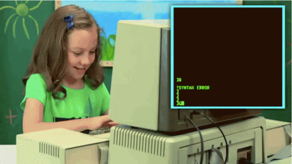
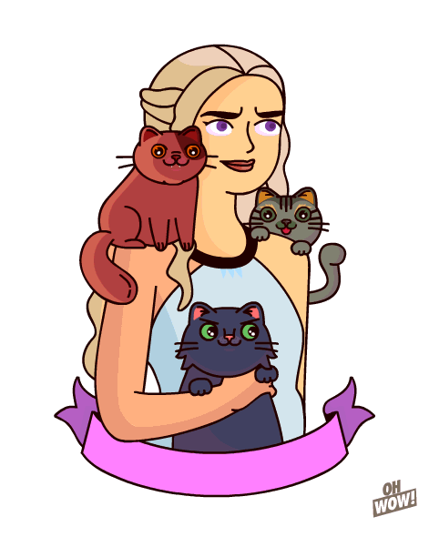

<!--
**AzaharaSiroco/AzaharaSiroco** is a ✨ _special_ ✨ repository because its `README.md` (this file) appears on your GitHub profile.

Here are some ideas to get you started:

- 🔭 I’m currently working on ...
- 🌱 I’m currently learning ...
- 👯 I’m looking to collaborate on ...
- 🤔 I’m looking for help with ...
- 💬 Ask me about ...
- 📫 How to reach me: ...
- 😄 Pronouns: ...
- ⚡ Fun fact: ...
-->
### Saludos terrícolas! 🖖 
!Bienvenid@s a mi repo! 🏞️ 

### Quién soy? 
Me llamo [Azahara][website], además de otras cosas, soy **desarrolladora Front-end junior**. Soy inquieta, creativa, alegre, comprometida, resolutiva, y, aunque me las apaño bien sola, me encanta trabajar en equipo. 

Al mundo de la programación he entrado de la mano de **Adalab** donde acabo de terminar el Bootcamp intensivo de Desarrollo Front.
Estoy deseando seguir el aprendizaje en el camino de la programación, y seguir expandiendo mis fronteras. Sky is the limit! 

Además soy publicista y fotógrafa profesional, sin dejar atrás una de las más importantes...

Yo soy Azahara Siroco... Mother of Cats  🔥🐈🔥🐈🔥🐈🔥.

### Conocimientos 🧠

##### Programación 👩‍💻

##### Fotografía y diseño 📷 📓

##### Herramientas 🔧

